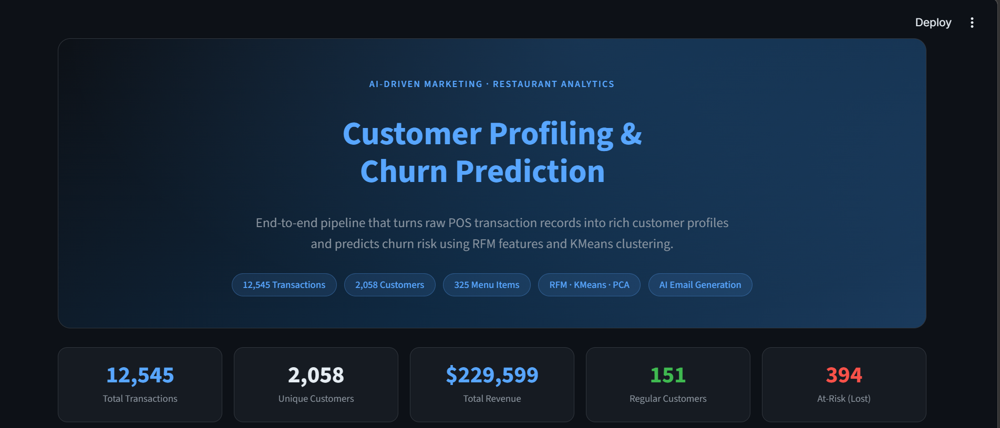
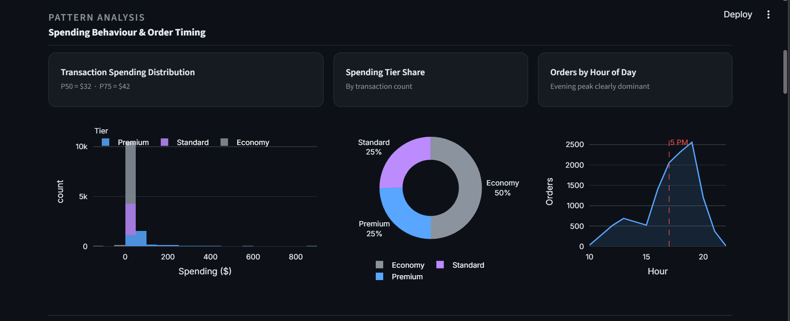
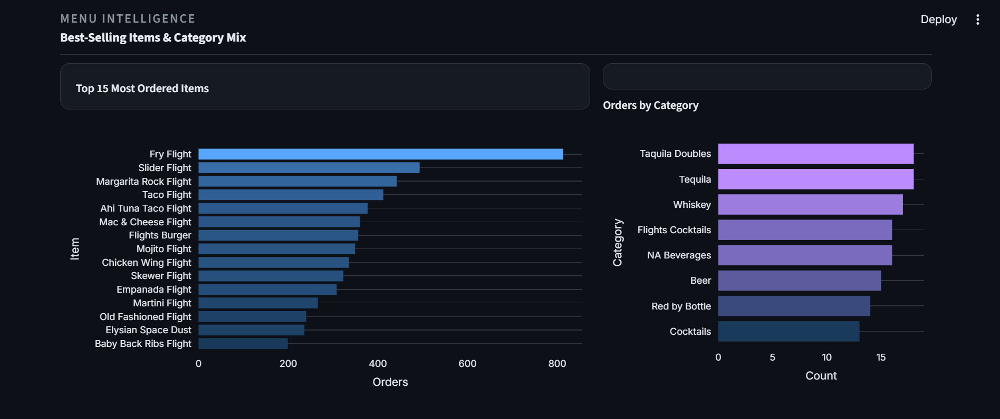
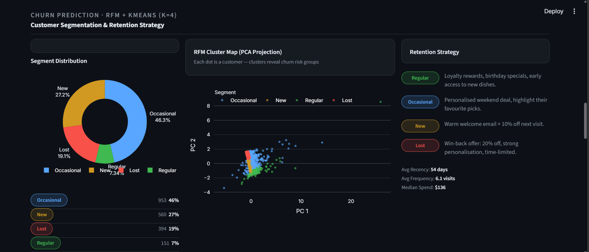
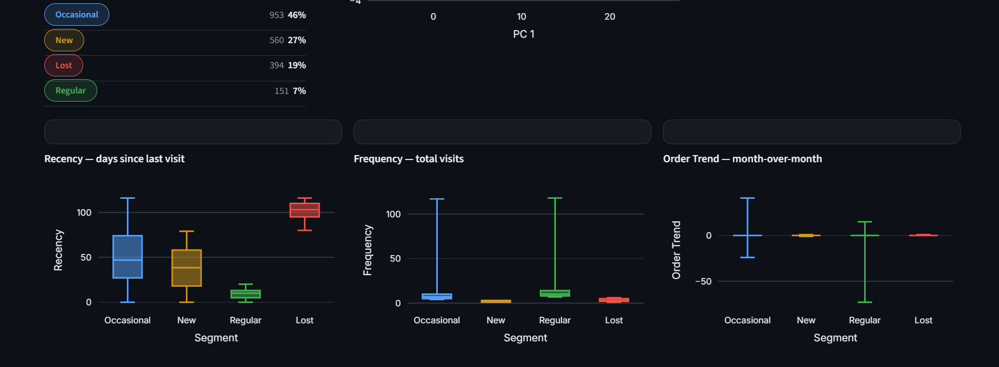

# Data Driven Dining

> **AI-Driven Marketing · Customer Profiling & Churn Prediction**
> End-to-end analytics pipeline that transforms raw restaurant POS data into actionable customer intelligence — with an AI-powered personalised email generator running fully locally via **Llama 3.2 (Ollama)**.

---

## Overview

This project analyses real restaurant transaction data across four phases to profile customers, identify behaviour patterns, predict churn risk, and generate targeted marketing emails — all from a single interactive Streamlit dashboard.

| Phase | What happens |
|-------|-------------|
| **I – Preprocessing** | Load & clean 12,545 transactions + 325 menu items, build composite join keys |
| **II – Pattern Analysis** | Classify spending (Premium / Standard / Economy), order timing (Morning / Mid-day / Evening) |
| **III – Customer Profiling** | One row per customer: lifetime spend, favourite picks, preferred timing, avg monthly orders |
| **IV – Churn Prediction** | RFM features (Recency, Frequency, Order Trend) → KMeans (k=4) → Regular / Occasional / New / Lost |

---
## Dashboard Snapshots

### Hero & KPI Metrics


---

### Spending Patterns & Order Timing


---

### Menu Intelligence — Top Items & Categories


---

### Churn Segmentation — RFM Clusters


---

### AI Email Generator (Llama 3.2 via Ollama)


---

## Tech Stack

| Layer | Tools |
|-------|-------|
| Data | pandas, numpy |
| ML | scikit-learn (KMeans, PCA, StandardScaler) |
| Visualisation | Plotly Express, Plotly Graph Objects |
| Frontend | Streamlit |
| AI / LLM | Llama 3.2 via Ollama (OpenAI-compatible API) |

---

## Run Locally

**Prerequisites:** Python 3.10+, [Ollama](https://ollama.com) installed and running.

```bash
# 1. Clone
git clone https://github.com/<your-username>/data-driven-dining.git
cd data-driven-dining

# 2. Create venv & install deps
python -m venv .venv
.venv\Scripts\activate        # Windows
pip install streamlit plotly pandas numpy scikit-learn openpyxl openai

# 3. Pull the model
ollama pull llama3.2

# 4. Place data files

# 5. Launch
streamlit run app.py
```

Open **http://localhost:8501** in your browser.

---


## Churn Segments & Retention Logic

| Segment | Criteria | Strategy |
|---------|----------|----------|
| **Regular** | Recency ≤ 20d & Frequency ≥ 7 | Loyalty rewards · birthday specials · early access |
| **Occasional** | Everything else | Personalised weekend deal · favourite picks highlight |
| **New** | Frequency ≤ 3 visits | Warm welcome email · 10% off next visit |
| **Lost** | Recency ≥ 80d & Frequency ≤ 6 | Win-back offer · 20% discount · time-limited |
